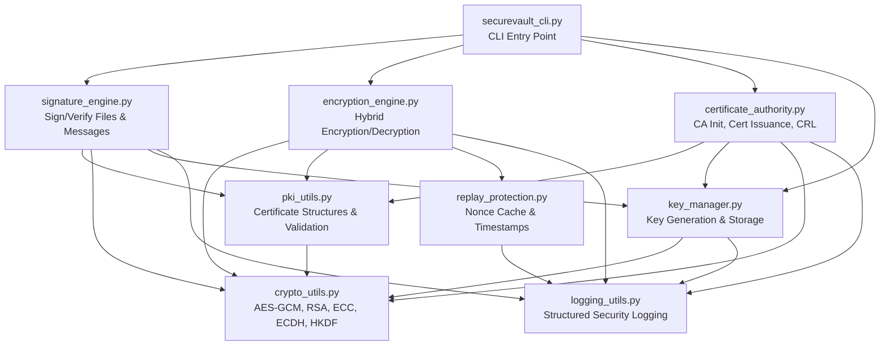
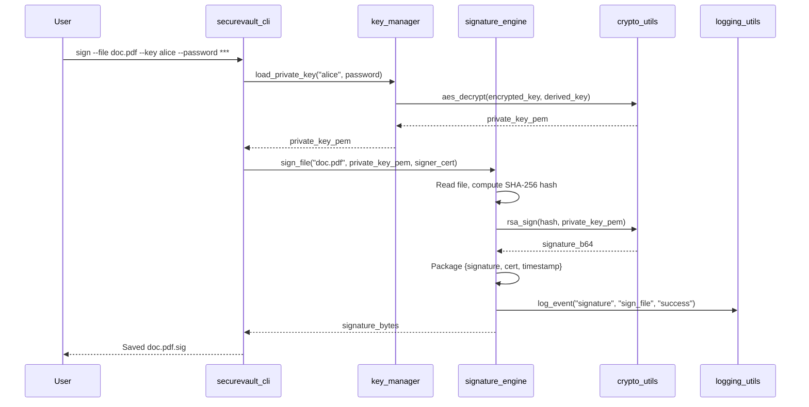
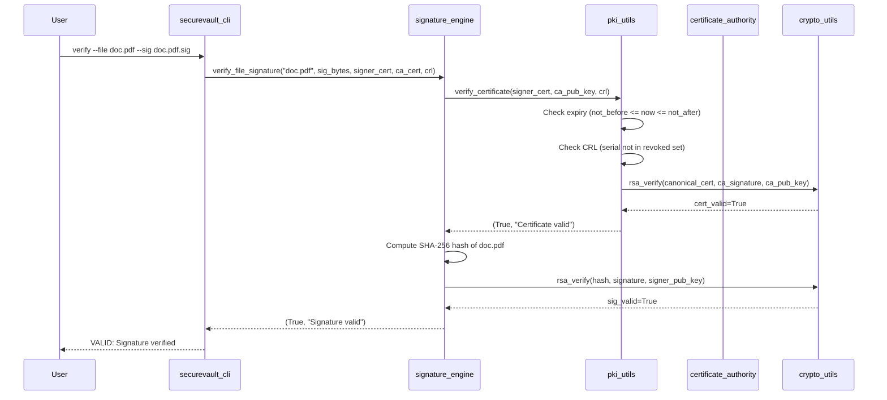
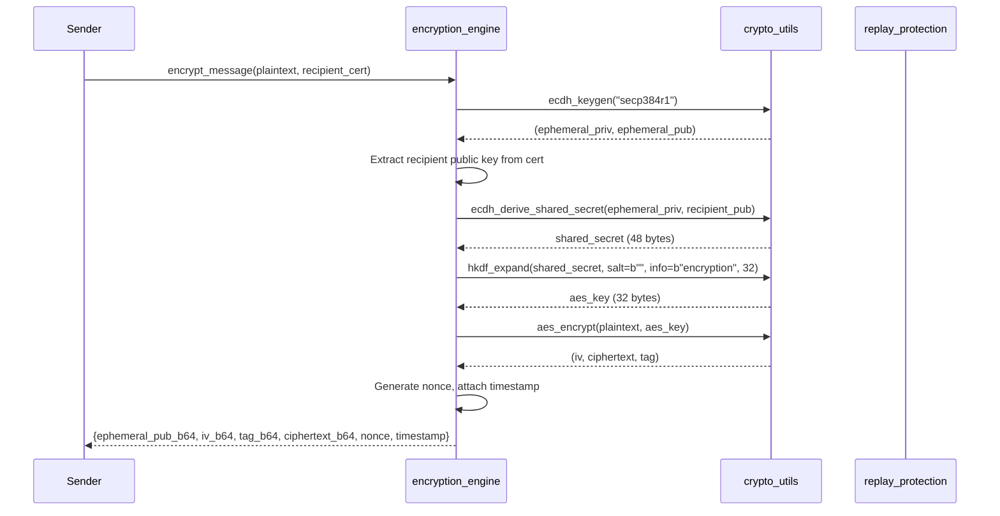
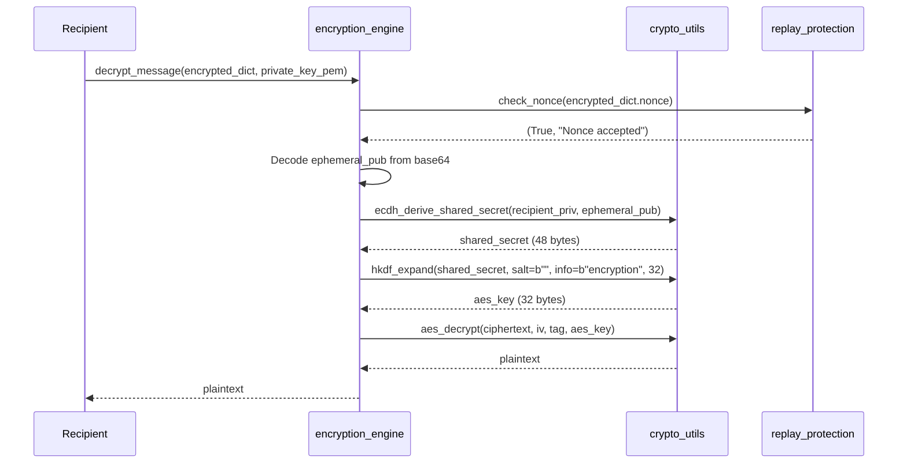
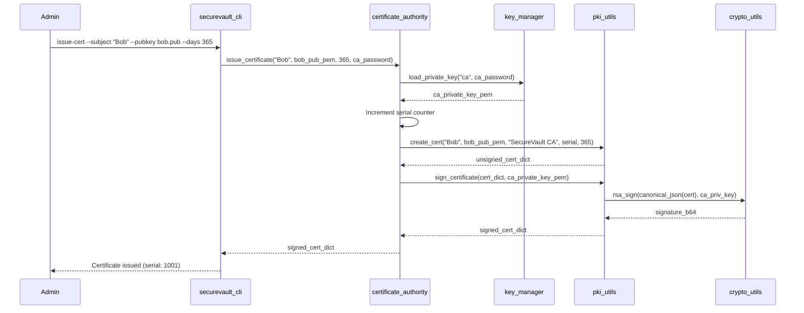

# Design Document: SecureVault PKI

## Overview

SecureVault PKI is an open-source cryptographic toolkit implementing a complete Public Key Infrastructure (PKI) system in Python. It provides PKI-based authentication, digital signatures (RSA-PSS/ECDSA), hybrid encryption (ephemeral ECDH + AES-256-GCM), and secure key management with encrypted-at-rest private keys.

The system is designed around defense-in-depth principles: authenticated encryption (AES-256-GCM) prevents tampering without additional MAC layers, ephemeral ECDH keys provide forward secrecy per message, and PBKDF2-protected keystores ensure key confidentiality at rest. The architecture is modular with clearly separated concerns—crypto primitives, PKI operations, key management, and application-layer engines—enabling independent testing, auditing, and extension.

The project targets educational and demonstration use cases (lawyer document signing, financial secure messaging, SaaS certificate revocation) while implementing production-grade cryptographic practices using Python's `cryptography` library as the sole crypto provider.


## Architecture

The system follows a layered architecture where higher-level engines compose lower-level primitives. Each layer only depends on the layer directly below it, ensuring clean separation and testability.




### Layer Descriptions

| Layer | Modules | Responsibility |
|-------|---------|---------------|
| **Presentation** | `securevault_cli.py` | CLI argument parsing, user interaction, output formatting |
| **Application** | `signature_engine.py`, `encryption_engine.py` | Business logic orchestration for signing, encryption workflows |
| **Domain** | `certificate_authority.py`, `key_manager.py`, `replay_protection.py` | PKI domain logic, key lifecycle, replay defense |
| **Infrastructure** | `pki_utils.py`, `crypto_utils.py`, `logging_utils.py` | Low-level crypto operations, certificate structures, logging |

## Sequence Diagrams

### Document Signing Flow




### Signature Verification Flow



### Hybrid Encryption Flow




### Hybrid Decryption Flow



### Certificate Issuance Flow




## Components and Interfaces

### Component 1: crypto_utils — Cryptographic Primitives

**Purpose**: Provides all low-level cryptographic operations as pure functions. This is the only module that directly interfaces with the `cryptography` library.

**Interface**:

```python
# Symmetric Encryption
def aes_encrypt(plaintext: bytes, key: bytes, aad: bytes = b"") -> tuple[bytes, bytes, bytes]:
    """AES-256-GCM encryption.
    
    Args:
        plaintext: Data to encrypt (arbitrary length)
        key: 256-bit (32-byte) encryption key
        aad: Additional authenticated data (optional, authenticated but not encrypted)
    
    Returns:
        Tuple of (iv: 12 bytes, ciphertext: same length as plaintext, tag: 16 bytes)
    
    Raises:
        ValueError: If key is not exactly 32 bytes
    """

def aes_decrypt(ciphertext: bytes, iv: bytes, tag: bytes, key: bytes, aad: bytes = b"") -> bytes:
    """AES-256-GCM decryption with authentication.
    
    Args:
        ciphertext: Encrypted data
        iv: 12-byte initialization vector
        tag: 16-byte authentication tag
        key: 256-bit (32-byte) decryption key
        aad: Additional authenticated data (must match encryption AAD)
    
    Returns:
        Decrypted plaintext bytes
    
    Raises:
        ValueError: If key is not exactly 32 bytes
        InvalidTag: If authentication fails (tampered data)
    """

# Asymmetric Key Generation
def rsa_keygen(key_size: int = 4096) -> tuple[bytes, bytes]:
    """Generate RSA key pair.
    
    Returns:
        Tuple of (private_key_pem, public_key_pem) as bytes
    """

def ecdh_keygen(curve: str = "secp384r1") -> tuple[bytes, bytes]:
    """Generate ECC key pair for ECDH/ECDSA.
    
    Returns:
        Tuple of (private_key_pem, public_key_pem) as bytes
    """

# Digital Signatures
def rsa_sign(message: bytes, private_key_pem: bytes) -> str:
    """RSA-PSS signature with SHA-256.
    
    Returns:
        Base64-encoded signature string
    """

def rsa_verify(message: bytes, signature_b64: str, public_key_pem: bytes) -> bool:
    """Verify RSA-PSS signature.
    
    Returns:
        True if signature is valid, False otherwise (never raises for invalid sig)
    """

# Key Agreement
def ecdh_derive_shared_secret(private_key_pem: bytes, public_key_pem: bytes) -> bytes:
    """Derive shared secret via ECDH.
    
    Returns:
        Raw shared secret bytes (48 bytes for P-384)
    """

def hkdf_expand(shared_secret: bytes, salt: bytes, info: bytes, length: int = 32) -> bytes:
    """Derive key from shared secret using HKDF-SHA256.
    
    Returns:
        Derived key of specified length
    """

# Utilities
def b64_encode(data: bytes) -> str:
    """Base64 encode bytes to URL-safe string."""

def b64_decode(data: str) -> bytes:
    """Base64 decode string to bytes."""

def constant_time_compare(a: bytes, b: bytes) -> bool:
    """Timing-safe comparison of two byte strings."""
```

**Responsibilities**:
- Wrap `cryptography` library calls with consistent error handling
- Ensure all random values come from CSPRNG (os.urandom)
- Provide constant-time comparison for security-sensitive operations
- Never log or expose key material


### Component 2: pki_utils — Certificate Structures & Validation

**Purpose**: Manages JSON-based certificate structures, canonical serialization, certificate signing, and chain validation.

**Interface**:

```python
from dataclasses import dataclass

@dataclass
class CertificateInfo:
    subject: str
    public_key: str        # PEM-encoded public key
    issuer: str
    serial: int
    not_before: float      # Unix timestamp
    not_after: float       # Unix timestamp
    signature: str         # Base64-encoded CA signature (empty for unsigned)

def create_cert(subject: str, public_key_pem: bytes, issuer: str, 
                serial: int, validity_days: int) -> dict:
    """Create unsigned certificate dictionary.
    
    Returns:
        Certificate dict with all fields except signature
    """

def sign_certificate(cert_dict: dict, ca_private_key_pem: bytes) -> dict:
    """Sign a certificate with the CA's private key.
    
    Signs canonical_json(cert_without_signature) using RSA-PSS.
    
    Returns:
        Certificate dict with 'signature' field populated
    """

def verify_certificate(cert: dict, ca_public_key_pem: bytes, crl: set = None) -> tuple[bool, str]:
    """Validate a certificate against CA and CRL.
    
    Checks:
        1. Signature validity (RSA-PSS verification)
        2. Temporal validity (not_before <= now <= not_after)
        3. Revocation status (serial not in CRL)
    
    Returns:
        (is_valid: bool, reason: str)
        Reasons: "Valid", "Expired", "Not yet valid", "Revoked", "Invalid signature"
    """

def canonical_json(obj: dict) -> str:
    """Deterministic JSON serialization for signing.
    
    Rules: sorted keys, no whitespace, UTF-8 encoding
    """

def serialize_cert_to_json(cert: dict) -> str:
    """Serialize certificate to JSON string for storage/transmission."""

def deserialize_cert_from_json(cert_json: str) -> dict:
    """Deserialize certificate from JSON string."""

def load_pem_public_key(pem: bytes):
    """Load a public key from PEM bytes."""

def load_pem_private_key(pem: bytes, password: bytes = None):
    """Load a private key from PEM bytes, optionally decrypting."""
```

**Responsibilities**:
- Define the JSON certificate schema
- Ensure deterministic serialization for signature integrity
- Validate full certificate chain (signature → expiry → revocation)
- Abstract PEM key loading from the rest of the system


### Component 3: key_manager — Key Generation & Encrypted Storage

**Purpose**: Manages the lifecycle of cryptographic keys including generation, encrypted persistence, retrieval, and deletion.

**Interface**:

```python
import os
from pathlib import Path

KEYSTORE_DIR = Path.home() / ".securevault" / "keys"

def generate_keypair(name: str, key_type: str = "rsa", key_size: int = 4096, 
                     password: str = "") -> None:
    """Generate and store an encrypted key pair.
    
    Storage format:
        {KEYSTORE_DIR}/{name}.priv  - PBKDF2-encrypted private key
        {KEYSTORE_DIR}/{name}.pub   - Public key (PEM, unencrypted)
    
    Encryption: PBKDF2(password, salt, 100000 iterations) -> AES-256-GCM(private_key)
    
    Raises:
        FileExistsError: If key with this name already exists
        ValueError: If key_type not in ("rsa", "ecc")
    """

def load_private_key(name: str, password: str) -> bytes:
    """Load and decrypt a private key from the keystore.
    
    Returns:
        Private key PEM bytes
    
    Raises:
        FileNotFoundError: If key does not exist
        ValueError: If password is incorrect (decryption fails)
    """

def load_public_key(name: str) -> bytes:
    """Load a public key from the keystore.
    
    Returns:
        Public key PEM bytes
    
    Raises:
        FileNotFoundError: If key does not exist
    """

def list_keys() -> list[str]:
    """List all key names in the keystore."""

def delete_key(name: str) -> None:
    """Securely delete a key pair from the keystore.
    
    Raises:
        FileNotFoundError: If key does not exist
    """
```

**Responsibilities**:
- Generate RSA-4096 and ECC P-384 key pairs
- Encrypt private keys at rest using PBKDF2 + AES-256-GCM
- Manage keystore directory structure
- Never expose plaintext private keys in logs or error messages

### Component 4: certificate_authority — CA Operations

**Purpose**: Implements Certificate Authority functionality including initialization, certificate issuance, and Certificate Revocation List (CRL) management.

**Interface**:

```python
CA_DIR = Path.home() / ".securevault" / "ca"

def init_ca(ca_name: str = "SecureVault CA", password: str = "") -> None:
    """Initialize the Certificate Authority.
    
    Creates:
        - CA RSA-4096 key pair (encrypted with password)
        - Self-signed CA certificate
        - Empty CRL
        - Serial counter file (starting at 1000)
    
    Raises:
        FileExistsError: If CA already initialized
    """

def issue_certificate(subject: str, public_key_pem: bytes, 
                      validity_days: int = 365, password: str = "") -> dict:
    """Issue a new certificate signed by the CA.
    
    Returns:
        Signed certificate dictionary
    
    Raises:
        RuntimeError: If CA not initialized
        ValueError: If password incorrect
    """

def revoke_certificate(serial: int, password: str = "") -> None:
    """Add certificate serial to the CRL.
    
    Raises:
        RuntimeError: If CA not initialized
        ValueError: If serial not found in issued certificates
    """

def get_ca_certificate() -> dict:
    """Get the CA's self-signed certificate."""

def get_crl() -> set[int]:
    """Get the current Certificate Revocation List as a set of serial numbers."""

def verify_issued_cert(cert: dict, password: str = "") -> tuple[bool, str]:
    """Verify a certificate was issued by this CA."""
```

**Responsibilities**:
- Manage CA key pair and self-signed certificate
- Issue certificates with incrementing serial numbers
- Maintain and persist CRL
- Validate CA password before any signing operation


### Component 5: signature_engine — Digital Signatures

**Purpose**: Provides high-level file and message signing/verification with full certificate chain validation.

**Interface**:

```python
def sign_file(filepath: str, private_key_pem: bytes, signer_cert: dict) -> bytes:
    """Sign a file, producing a detached signature.
    
    Process:
        1. Read file contents
        2. Compute SHA-256 hash
        3. Sign hash with RSA-PSS
        4. Package: JSON{signature_b64, signer_cert, timestamp, filename}
    
    Returns:
        UTF-8 encoded JSON signature bytes (for .sig file)
    """

def sign_message(message: bytes, private_key_pem: bytes, signer_cert: dict) -> bytes:
    """Sign an in-memory message.
    
    Returns:
        UTF-8 encoded JSON signature bytes
    """

def verify_file_signature(filepath: str, signature: bytes, signer_cert: dict,
                          ca_cert: dict, crl: set = None) -> tuple[bool, str]:
    """Verify a file's detached signature.
    
    Validation order:
        1. Verify certificate chain (cert -> CA)
        2. Check certificate not revoked
        3. Verify RSA-PSS signature against file hash
    
    Returns:
        (is_valid: bool, reason: str)
    """

def verify_message_signature(message: bytes, signature: bytes, signer_cert: dict,
                             ca_cert: dict, crl: set = None) -> tuple[bool, str]:
    """Verify an in-memory message signature.
    
    Returns:
        (is_valid: bool, reason: str)
    """
```

**Responsibilities**:
- Orchestrate the signing workflow (read → hash → sign → package)
- Perform complete verification (chain validation → signature check)
- Generate detached signature files
- Log all signing and verification events

### Component 6: encryption_engine — Hybrid Encryption

**Purpose**: Implements hybrid encryption combining ephemeral ECDH key agreement with AES-256-GCM symmetric encryption for forward secrecy.

**Interface**:

```python
def encrypt_message(plaintext: bytes, recipient_cert: dict) -> dict:
    """Encrypt a message for a specific recipient.
    
    Process:
        1. Generate ephemeral ECDH key pair
        2. ECDH with recipient's public key
        3. HKDF-SHA256 to derive AES key
        4. AES-256-GCM encrypt
        5. Generate nonce + timestamp for replay protection
    
    Returns:
        {
            "ephemeral_pub_b64": str,
            "iv_b64": str,
            "tag_b64": str,
            "ciphertext_b64": str,
            "nonce_b64": str,
            "timestamp": float
        }
    """

def encrypt_file(filepath: str, recipient_cert: dict, output_path: str = None) -> None:
    """Encrypt a file for a specific recipient.
    
    Output: JSON file containing encrypted message dict
    Default output_path: {filepath}.enc
    """

def decrypt_message(encrypted_dict: dict, private_key_pem: bytes) -> bytes:
    """Decrypt a message using recipient's private key.
    
    Process:
        1. Decode ephemeral public key
        2. ECDH with recipient's private key
        3. HKDF-SHA256 to derive same AES key
        4. AES-256-GCM decrypt (tag verified automatically)
    
    Returns:
        Decrypted plaintext bytes
    
    Raises:
        InvalidTag: If ciphertext was tampered with
        ValueError: If message format is invalid
    """

def decrypt_file(filepath: str, private_key_pem: bytes, output_path: str = None) -> None:
    """Decrypt an encrypted file.
    
    Default output_path: {filepath} with .enc extension removed
    """
```

**Responsibilities**:
- Generate ephemeral keys (never persisted) for forward secrecy
- Derive symmetric keys via ECDH + HKDF
- Attach replay protection metadata (nonce, timestamp)
- Securely erase ephemeral private key material after use


### Component 7: replay_protection — Nonce Cache & Timestamp Validation

**Purpose**: Prevents replay attacks by maintaining an in-memory cache of recently seen nonces with automatic expiry.

**Interface**:

```python
import time
from threading import Lock

class ReplayProtector:
    def __init__(self, window_seconds: int = 60):
        """Initialize replay protector with time window.
        
        Args:
            window_seconds: How long to remember nonces (default 60s)
        """
        self._nonces: dict[bytes, float] = {}  # nonce -> timestamp
        self._window = window_seconds
        self._lock = Lock()
    
    def check_nonce(self, nonce: bytes, timestamp: float = None) -> tuple[bool, str]:
        """Check if a nonce is fresh (not replayed).
        
        Validation:
            1. Timestamp within acceptable window (now - window <= ts <= now)
            2. Nonce not previously seen
            3. If both pass, record nonce
        
        Returns:
            (is_fresh: bool, reason: str)
            Reasons: "Accepted", "Replay detected", "Timestamp expired", "Timestamp in future"
        """
    
    def _evict_stale_nonces(self) -> None:
        """Remove nonces older than the time window."""
    
    def generate_nonce(self) -> bytes:
        """Generate a cryptographically random 16-byte nonce."""
```

**Responsibilities**:
- Thread-safe nonce tracking
- Automatic eviction of expired nonces
- Timestamp validation (reject too old or future timestamps)
- CSPRNG nonce generation

### Component 8: logging_utils — Structured Security Logging

**Purpose**: Provides structured, auditable logging for all security-relevant operations.

**Interface**:

```python
import logging

def setup_logging(log_level: str = "INFO", log_file: str = None) -> None:
    """Configure structured logging.
    
    Format: JSON lines with timestamp, component, event, result, details
    """

def log_event(component: str, event: str, result: str, details: dict = None) -> None:
    """Log a security event.
    
    Args:
        component: Module name (e.g., "signature_engine")
        event: Operation (e.g., "sign_file", "verify_cert")
        result: Outcome (e.g., "success", "failure", "error")
        details: Additional context (NEVER include key material)
    """
```

**Responsibilities**:
- Structured JSON log output for machine parsing
- Automatic timestamp and correlation ID injection
- Explicit prohibition of logging key material
- Configurable log levels and output destinations


## Data Models

### Certificate Schema (JSON)

```python
certificate_schema = {
    "subject": str,           # e.g., "Alice Smith"
    "public_key": str,        # PEM-encoded public key
    "issuer": str,            # e.g., "SecureVault CA"
    "serial": int,            # Unique serial number (monotonically increasing)
    "not_before": float,      # Unix timestamp (certificate start)
    "not_after": float,       # Unix timestamp (certificate expiry)
    "key_type": str,          # "rsa" or "ecc"
    "signature": str          # Base64-encoded RSA-PSS signature of canonical form
}
```

**Validation Rules**:
- `subject` must be non-empty string, max 256 characters
- `serial` must be positive integer, unique across all issued certificates
- `not_before` must be less than `not_after`
- `not_after - not_before` must be between 1 day and 10 years
- `signature` must be valid RSA-PSS signature over `canonical_json(cert_without_signature)`
- `public_key` must be valid PEM-encoded RSA or ECC public key
- `key_type` must be one of: "rsa", "ecc"

### Detached Signature Schema (JSON)

```python
signature_schema = {
    "version": int,           # Schema version (currently 1)
    "algorithm": str,         # "RSA-PSS-SHA256"
    "signature": str,         # Base64-encoded signature
    "signer_cert": dict,      # Full signer certificate (for verification)
    "timestamp": float,       # Unix timestamp of signing
    "filename": str           # Original filename (for reference only)
}
```

**Validation Rules**:
- `version` must equal 1
- `algorithm` must be "RSA-PSS-SHA256"
- `signature` must be valid base64
- `signer_cert` must be a valid certificate dict
- `timestamp` must be a valid Unix timestamp (not in the future)

### Encrypted Message Schema (JSON)

```python
encrypted_message_schema = {
    "version": int,           # Schema version (currently 1)
    "algorithm": str,         # "ECDH-P384+HKDF-SHA256+AES-256-GCM"
    "ephemeral_pub_b64": str, # Base64 PEM of ephemeral ECDH public key
    "iv_b64": str,            # Base64 of 12-byte IV
    "tag_b64": str,           # Base64 of 16-byte GCM auth tag
    "ciphertext_b64": str,    # Base64 of encrypted data
    "nonce_b64": str,         # Base64 of 16-byte replay protection nonce
    "timestamp": float        # Unix timestamp of encryption
}
```

**Validation Rules**:
- `iv_b64` must decode to exactly 12 bytes
- `tag_b64` must decode to exactly 16 bytes
- `nonce_b64` must decode to exactly 16 bytes
- `ephemeral_pub_b64` must decode to a valid ECC P-384 public key
- `timestamp` must be within acceptable replay window

### Key Storage Format

```python
# Private key storage: {name}.priv
private_key_storage = {
    "version": int,           # Storage format version (currently 1)
    "key_type": str,          # "rsa" or "ecc"
    "algorithm": str,         # "PBKDF2-SHA256+AES-256-GCM"
    "salt_b64": str,          # Base64 of 16-byte PBKDF2 salt
    "iterations": int,        # PBKDF2 iterations (>=100000)
    "iv_b64": str,            # Base64 of 12-byte AES-GCM IV
    "tag_b64": str,           # Base64 of 16-byte AES-GCM tag
    "encrypted_key_b64": str  # Base64 of encrypted private key PEM
}
```

**Validation Rules**:
- `iterations` must be >= 100,000
- `salt_b64` must decode to exactly 16 bytes
- `iv_b64` must decode to exactly 12 bytes
- `tag_b64` must decode to exactly 16 bytes


## Algorithmic Pseudocode

### Algorithm 1: AES-256-GCM Encryption

```python
def aes_encrypt(plaintext: bytes, key: bytes, aad: bytes = b"") -> tuple[bytes, bytes, bytes]:
    """
    ALGORITHM: AES-256-GCM Authenticated Encryption
    INPUT: plaintext (arbitrary bytes), key (32 bytes), aad (optional bytes)
    OUTPUT: (iv, ciphertext, tag) where iv=12 bytes, tag=16 bytes
    """
    # PRECONDITIONS
    assert len(key) == 32, "Key must be exactly 256 bits"
    assert isinstance(plaintext, bytes), "Plaintext must be bytes"
    
    # Step 1: Generate random IV from CSPRNG
    iv = os.urandom(12)  # 96-bit IV as recommended for GCM
    
    # Step 2: Construct cipher with key and IV
    cipher = AESGCM(key)
    
    # Step 3: Encrypt with associated data
    # GCM internally: CTR-mode encrypt + GHASH for tag
    ciphertext_and_tag = cipher.encrypt(nonce=iv, data=plaintext, associated_data=aad)
    
    # Step 4: Split ciphertext and authentication tag
    ciphertext = ciphertext_and_tag[:-16]
    tag = ciphertext_and_tag[-16:]
    
    # POSTCONDITIONS
    assert len(iv) == 12
    assert len(tag) == 16
    assert len(ciphertext) == len(plaintext)
    
    return (iv, ciphertext, tag)
```

**Preconditions:**
- `key` is exactly 32 bytes (256 bits)
- `plaintext` is a valid bytes object (may be empty)
- `aad` is a valid bytes object (may be empty)
- CSPRNG is available and properly seeded

**Postconditions:**
- `iv` is exactly 12 bytes, randomly generated
- `ciphertext` has same length as `plaintext`
- `tag` is exactly 16 bytes (128-bit authentication tag)
- `aes_decrypt(ciphertext, iv, tag, key, aad)` recovers original `plaintext`
- Any modification to `ciphertext`, `iv`, `tag`, or `aad` causes decryption to fail

**Loop Invariants:** N/A (no loops)

### Algorithm 2: ECDH Key Agreement + HKDF Derivation

```python
def hybrid_key_derive(sender_private_pem: bytes, recipient_public_pem: bytes) -> bytes:
    """
    ALGORITHM: ECDH Key Agreement with HKDF Key Derivation
    INPUT: sender's private key (ECC P-384), recipient's public key (ECC P-384)
    OUTPUT: derived_key (32 bytes, suitable for AES-256)
    """
    # PRECONDITIONS
    assert is_valid_ecc_private_key(sender_private_pem, curve="secp384r1")
    assert is_valid_ecc_public_key(recipient_public_pem, curve="secp384r1")
    
    # Step 1: Load keys from PEM format
    private_key = load_pem_private_key(sender_private_pem)
    public_key = load_pem_public_key(recipient_public_pem)
    
    # Step 2: Perform ECDH to get shared secret
    # Both parties compute: shared_secret = private_key * public_key_point
    # This is the x-coordinate of the resulting EC point
    shared_secret = private_key.exchange(ECDH(), public_key)
    # For P-384: shared_secret is 48 bytes
    
    # Step 3: Derive AES key using HKDF-SHA256
    # HKDF: Extract-then-Expand
    #   Extract: PRK = HMAC-SHA256(salt, shared_secret)
    #   Expand:  OKM = HMAC-SHA256(PRK, info || 0x01)
    derived_key = HKDF(
        algorithm=SHA256(),
        length=32,          # 256 bits for AES-256
        salt=b"",           # Empty salt (HKDF uses zero-filled hash-length salt)
        info=b"encryption"  # Context separation
    ).derive(shared_secret)
    
    # Step 4: Securely clear shared_secret from memory
    # (Best effort - Python GC may retain copies)
    del shared_secret
    
    # POSTCONDITIONS
    assert len(derived_key) == 32
    # Deterministic: same inputs always produce same derived_key
    
    return derived_key
```

**Preconditions:**
- Both keys are valid ECC P-384 keys on the secp384r1 curve
- Private key and public key are from different key pairs
- Keys are properly PEM-encoded

**Postconditions:**
- `derived_key` is exactly 32 bytes
- Same input keys always produce the same derived key (deterministic)
- Derived key is cryptographically uniform (indistinguishable from random)
- Knowledge of one party's public key alone is insufficient to derive the key

**Loop Invariants:** N/A (no loops)


### Algorithm 3: Certificate Chain Validation

```python
def verify_certificate(cert: dict, ca_public_key_pem: bytes, crl: set = None) -> tuple[bool, str]:
    """
    ALGORITHM: Certificate Chain Validation
    INPUT: certificate dict, CA public key, optional CRL set
    OUTPUT: (is_valid, reason) tuple
    """
    # PRECONDITIONS
    assert "subject" in cert and "signature" in cert
    assert "not_before" in cert and "not_after" in cert
    assert "serial" in cert
    assert is_valid_public_key(ca_public_key_pem)
    
    current_time = time.time()
    
    # Step 1: Check temporal validity
    if current_time < cert["not_before"]:
        return (False, "Not yet valid")
    
    if current_time > cert["not_after"]:
        return (False, "Expired")
    
    # Step 2: Check revocation status
    if crl is not None and cert["serial"] in crl:
        return (False, "Revoked")
    
    # Step 3: Verify CA signature
    # Remove signature field to get the signed content
    cert_without_sig = {k: v for k, v in cert.items() if k != "signature"}
    signed_content = canonical_json(cert_without_sig).encode("utf-8")
    
    # Verify RSA-PSS signature
    is_sig_valid = rsa_verify(signed_content, cert["signature"], ca_public_key_pem)
    
    if not is_sig_valid:
        return (False, "Invalid signature")
    
    # POSTCONDITIONS
    # All checks passed
    return (True, "Valid")
```

**Preconditions:**
- `cert` is a well-formed certificate dictionary with all required fields
- `ca_public_key_pem` is the CA's valid RSA public key
- `crl` is either None or a set of revoked serial numbers
- System clock is reasonably accurate

**Postconditions:**
- Returns `(True, "Valid")` only if ALL of: temporal validity, non-revocation, and signature are verified
- Returns `(False, reason)` with specific failure reason on first failed check
- Validation order is deterministic: temporal → revocation → signature
- No side effects (pure validation function)

**Loop Invariants:** N/A (sequential checks, no loops)

### Algorithm 4: Hybrid Encryption (Full Flow)

```python
def encrypt_message(plaintext: bytes, recipient_cert: dict) -> dict:
    """
    ALGORITHM: Hybrid Encryption with Forward Secrecy
    INPUT: plaintext bytes, recipient's certificate
    OUTPUT: encrypted message dictionary
    """
    # PRECONDITIONS
    assert isinstance(plaintext, bytes) and len(plaintext) > 0
    assert verify_certificate(recipient_cert, ca_pub_key)[0] == True
    assert recipient_cert["key_type"] == "ecc"
    
    # Step 1: Generate ephemeral ECDH key pair (NEVER persisted)
    ephemeral_priv_pem, ephemeral_pub_pem = ecdh_keygen("secp384r1")
    
    # Step 2: Extract recipient's public key from certificate
    recipient_pub_pem = recipient_cert["public_key"].encode("utf-8")
    
    # Step 3: Perform ECDH key agreement
    shared_secret = ecdh_derive_shared_secret(ephemeral_priv_pem, recipient_pub_pem)
    
    # Step 4: Derive AES-256 key via HKDF
    aes_key = hkdf_expand(
        shared_secret=shared_secret,
        salt=b"",
        info=b"encryption",
        length=32
    )
    
    # Step 5: Encrypt with AES-256-GCM
    iv, ciphertext, tag = aes_encrypt(plaintext, aes_key)
    
    # Step 6: Generate replay protection nonce
    nonce = os.urandom(16)
    timestamp = time.time()
    
    # Step 7: Securely erase ephemeral private key and shared secret
    del ephemeral_priv_pem
    del shared_secret
    del aes_key
    
    # Step 8: Package encrypted message
    encrypted_msg = {
        "version": 1,
        "algorithm": "ECDH-P384+HKDF-SHA256+AES-256-GCM",
        "ephemeral_pub_b64": b64_encode(ephemeral_pub_pem),
        "iv_b64": b64_encode(iv),
        "tag_b64": b64_encode(tag),
        "ciphertext_b64": b64_encode(ciphertext),
        "nonce_b64": b64_encode(nonce),
        "timestamp": timestamp
    }
    
    # POSTCONDITIONS
    assert len(b64_decode(encrypted_msg["iv_b64"])) == 12
    assert len(b64_decode(encrypted_msg["tag_b64"])) == 16
    assert len(b64_decode(encrypted_msg["nonce_b64"])) == 16
    # ephemeral_priv_pem is no longer accessible
    # decrypt_message(encrypted_msg, recipient_private_key) == plaintext
    
    return encrypted_msg
```

**Preconditions:**
- `plaintext` is non-empty bytes
- `recipient_cert` contains a valid ECC P-384 public key
- `recipient_cert` has been validated (not expired, not revoked)
- CSPRNG is available

**Postconditions:**
- Ephemeral private key is deleted after use (forward secrecy)
- Output contains all fields needed for decryption
- Only the holder of recipient's private key can decrypt
- Each encryption produces unique (iv, nonce, ephemeral_key) even for same plaintext
- `decrypt_message(result, recipient_priv_key)` recovers original plaintext

**Loop Invariants:** N/A (sequential steps)


### Algorithm 5: Replay Protection Check

```python
def check_nonce(self, nonce: bytes, timestamp: float = None) -> tuple[bool, str]:
    """
    ALGORITHM: Nonce-based Replay Detection
    INPUT: nonce (16 bytes), optional timestamp
    OUTPUT: (is_fresh, reason)
    """
    # PRECONDITIONS
    assert isinstance(nonce, bytes) and len(nonce) == 16
    
    current_time = time.time()
    if timestamp is None:
        timestamp = current_time
    
    with self._lock:  # Thread-safe access
        # Step 1: Evict stale nonces (housekeeping)
        self._evict_stale_nonces()
        
        # Step 2: Validate timestamp freshness
        age = current_time - timestamp
        if age > self._window:
            return (False, "Timestamp expired")
        if age < -5.0:  # Allow 5s clock skew for "future" messages
            return (False, "Timestamp in future")
        
        # Step 3: Check for replay (nonce already seen)
        if nonce in self._nonces:
            return (False, "Replay detected")
        
        # Step 4: Record nonce with timestamp
        self._nonces[nonce] = timestamp
        
        # POSTCONDITIONS
        # nonce is now in self._nonces
        # Same nonce will be rejected until evicted
        return (True, "Accepted")

def _evict_stale_nonces(self) -> None:
    """
    ALGORITHM: Stale Nonce Eviction
    INPUT: self._nonces dict
    OUTPUT: self._nonces with stale entries removed
    
    LOOP INVARIANT: All remaining nonces have timestamp > (now - window)
    """
    current_time = time.time()
    cutoff = current_time - self._window
    
    # Collect stale keys (cannot modify dict during iteration)
    stale_keys = [k for k, ts in self._nonces.items() if ts < cutoff]
    
    # Remove stale entries
    for key in stale_keys:
        del self._nonces[key]
    
    # POSTCONDITION: All remaining nonces are within the time window
    assert all(ts >= cutoff for ts in self._nonces.values())
```

**Preconditions:**
- `nonce` is exactly 16 bytes
- `self._lock` ensures exclusive access in multi-threaded scenarios
- `self._window` is a positive number of seconds

**Postconditions:**
- Returns `(True, "Accepted")` only for fresh, never-before-seen nonces within the time window
- Once accepted, the same nonce will be rejected until it expires from the cache
- Stale nonces are automatically evicted to prevent unbounded memory growth
- Thread-safe: concurrent calls do not produce race conditions

**Loop Invariants:**
- In `_evict_stale_nonces`: After processing, all remaining entries satisfy `timestamp >= cutoff`
- In `check_nonce`: The nonces dict never contains entries older than `window_seconds`

### Algorithm 6: Key Storage (PBKDF2 + AES-256-GCM)

```python
def generate_keypair(name: str, key_type: str = "rsa", key_size: int = 4096,
                     password: str = "") -> None:
    """
    ALGORITHM: Key Generation with Encrypted Storage
    INPUT: key name, type, size, password
    OUTPUT: Encrypted key files written to keystore
    """
    # PRECONDITIONS
    assert name and len(name) <= 64
    assert key_type in ("rsa", "ecc")
    assert not (KEYSTORE_DIR / f"{name}.priv").exists(), "Key already exists"
    
    # Step 1: Generate key pair based on type
    if key_type == "rsa":
        private_pem, public_pem = rsa_keygen(key_size)
    else:
        private_pem, public_pem = ecdh_keygen("secp384r1")
    
    # Step 2: Derive encryption key from password
    salt = os.urandom(16)
    iterations = 100_000
    derived_key = pbkdf2_hmac(
        hash_name="sha256",
        password=password.encode("utf-8"),
        salt=salt,
        iterations=iterations,
        dklen=32  # 256-bit key for AES-256
    )
    
    # Step 3: Encrypt private key with derived key
    iv, encrypted_key, tag = aes_encrypt(private_pem, derived_key)
    
    # Step 4: Store encrypted private key
    storage = {
        "version": 1,
        "key_type": key_type,
        "algorithm": "PBKDF2-SHA256+AES-256-GCM",
        "salt_b64": b64_encode(salt),
        "iterations": iterations,
        "iv_b64": b64_encode(iv),
        "tag_b64": b64_encode(tag),
        "encrypted_key_b64": b64_encode(encrypted_key)
    }
    write_json(KEYSTORE_DIR / f"{name}.priv", storage)
    
    # Step 5: Store public key (unencrypted PEM)
    write_bytes(KEYSTORE_DIR / f"{name}.pub", public_pem)
    
    # Step 6: Securely erase sensitive material
    del private_pem, derived_key
    
    # POSTCONDITIONS
    assert (KEYSTORE_DIR / f"{name}.priv").exists()
    assert (KEYSTORE_DIR / f"{name}.pub").exists()
    # private_pem cannot be recovered without correct password
```

**Preconditions:**
- `name` is a valid, non-empty string (max 64 chars, filesystem-safe)
- `key_type` is either "rsa" or "ecc"
- No key with this name already exists in the keystore
- CSPRNG is available for salt and key generation

**Postconditions:**
- Two files created: `{name}.priv` (encrypted) and `{name}.pub` (PEM)
- Private key can only be recovered with the correct password
- PBKDF2 with 100,000 iterations provides brute-force resistance
- Plaintext private key is deleted from memory after encryption

**Loop Invariants:** N/A (sequential steps)


### Algorithm 7: File Signing (Detached Signature)

```python
def sign_file(filepath: str, private_key_pem: bytes, signer_cert: dict) -> bytes:
    """
    ALGORITHM: Detached File Signature Generation
    INPUT: file path, signer's private key, signer's certificate
    OUTPUT: detached signature as JSON bytes
    """
    # PRECONDITIONS
    assert os.path.isfile(filepath), "File must exist"
    assert is_valid_rsa_private_key(private_key_pem)
    assert "signature" in signer_cert  # cert must be signed
    
    # Step 1: Read file contents
    with open(filepath, "rb") as f:
        file_data = f.read()
    
    # Step 2: Compute SHA-256 hash of file
    file_hash = sha256(file_data)  # 32 bytes
    
    # Step 3: Sign the hash with RSA-PSS
    signature_b64 = rsa_sign(file_hash, private_key_pem)
    
    # Step 4: Package detached signature
    sig_package = {
        "version": 1,
        "algorithm": "RSA-PSS-SHA256",
        "signature": signature_b64,
        "signer_cert": signer_cert,
        "timestamp": time.time(),
        "filename": os.path.basename(filepath)
    }
    
    # Step 5: Serialize to JSON bytes
    result = json.dumps(sig_package, indent=2).encode("utf-8")
    
    # Step 6: Log signing event
    log_event("signature_engine", "sign_file", "success", {
        "filename": os.path.basename(filepath),
        "subject": signer_cert["subject"]
    })
    
    # POSTCONDITIONS
    # verify_file_signature(filepath, result, signer_cert, ca_cert) == (True, "Valid")
    assert json.loads(result)["signature"] == signature_b64
    
    return result
```

**Preconditions:**
- File exists and is readable
- `private_key_pem` is a valid RSA private key corresponding to the cert's public key
- `signer_cert` is a valid, signed certificate

**Postconditions:**
- Returns valid JSON containing the detached signature
- Signature is verifiable with the public key in `signer_cert`
- Signature covers the SHA-256 hash of the file contents
- Original file is not modified

**Loop Invariants:** N/A

## Key Functions with Formal Specifications

### Function: `canonical_json`

```python
def canonical_json(obj: dict) -> str:
    """Deterministic JSON serialization for cryptographic signing."""
    return json.dumps(obj, sort_keys=True, separators=(",", ":"), ensure_ascii=True)
```

**Preconditions:**
- `obj` is a JSON-serializable dictionary
- All values are primitive types (str, int, float, bool, None) or nested dicts/lists

**Postconditions:**
- Output is deterministic: `canonical_json(obj) == canonical_json(obj)` always
- Keys are lexicographically sorted at all nesting levels
- No extraneous whitespace
- ASCII-safe encoding
- `canonical_json(a) == canonical_json(b)` implies `a` and `b` have identical structure and values

### Function: `constant_time_compare`

```python
def constant_time_compare(a: bytes, b: bytes) -> bool:
    """Timing-safe byte comparison to prevent timing attacks."""
    return hmac.compare_digest(a, b)
```

**Preconditions:**
- `a` and `b` are bytes objects

**Postconditions:**
- Returns `True` if and only if `a == b`
- Execution time is constant regardless of where first difference occurs
- Prevents timing side-channel attacks on signature/MAC verification


## Example Usage

### Example 1: Complete PKI Setup and Document Signing

```python
from securevault import (
    certificate_authority as ca,
    key_manager as km,
    signature_engine as se
)

# Initialize CA
ca.init_ca(ca_name="Acme Corp CA", password="ca-secret-2024")

# Generate user key pair
km.generate_keypair("alice", key_type="rsa", key_size=4096, password="alice-pass")

# Issue certificate for Alice
alice_pub = km.load_public_key("alice")
alice_cert = ca.issue_certificate(
    subject="Alice Johnson",
    public_key_pem=alice_pub,
    validity_days=365,
    password="ca-secret-2024"
)

# Sign a document
alice_priv = km.load_private_key("alice", password="alice-pass")
signature = se.sign_file("contract.pdf", alice_priv, alice_cert)

# Save detached signature
with open("contract.pdf.sig", "wb") as f:
    f.write(signature)
```

### Example 2: Signature Verification with CRL Check

```python
from securevault import certificate_authority as ca, signature_engine as se

# Load signature file
with open("contract.pdf.sig", "rb") as f:
    signature = f.read()

# Parse signature to extract signer cert
import json
sig_data = json.loads(signature)
signer_cert = sig_data["signer_cert"]

# Verify with CRL check
ca_cert = ca.get_ca_certificate()
crl = ca.get_crl()

is_valid, reason = se.verify_file_signature(
    "contract.pdf", signature, signer_cert, ca_cert, crl
)

if is_valid:
    print(f"VALID: Signed by {signer_cert['subject']}")
else:
    print(f"INVALID: {reason}")
```

### Example 3: Hybrid Encryption with Forward Secrecy

```python
from securevault import (
    encryption_engine as ee,
    key_manager as km,
    certificate_authority as ca
)

# Setup: Bob has an ECC key pair and certificate
km.generate_keypair("bob", key_type="ecc", password="bob-pass")
bob_pub = km.load_public_key("bob")
bob_cert = ca.issue_certificate(
    subject="Bob Smith",
    public_key_pem=bob_pub,
    validity_days=365,
    password="ca-secret-2024"
)

# Alice encrypts a message for Bob
message = b"Confidential financial report Q4 2024"
encrypted = ee.encrypt_message(message, bob_cert)

# Bob decrypts the message
bob_priv = km.load_private_key("bob", password="bob-pass")
decrypted = ee.decrypt_message(encrypted, bob_priv)

assert decrypted == message  # Original message recovered
```

### Example 4: Certificate Revocation

```python
from securevault import certificate_authority as ca, signature_engine as se

# Revoke a compromised certificate
ca.revoke_certificate(serial=1001, password="ca-secret-2024")

# Subsequent verification fails
crl = ca.get_crl()  # Now contains serial 1001
ca_cert = ca.get_ca_certificate()

is_valid, reason = se.verify_file_signature(
    "contract.pdf", signature, compromised_cert, ca_cert, crl
)
# is_valid == False, reason == "Revoked"
```

### Example 5: CLI Usage

```bash
# Initialize CA
securevault init-ca --name "MyOrg CA" --password "strong-pass"

# Generate key pair
securevault keygen --name alice --type rsa --size 4096 --password "key-pass"

# Issue certificate
securevault issue-cert --subject "Alice" --pubkey alice.pub --days 365 --ca-password "strong-pass"

# Sign a file
securevault sign --file report.pdf --key alice --password "key-pass"

# Verify a signature
securevault verify --file report.pdf --sig report.pdf.sig

# Encrypt a file
securevault encrypt --file secret.txt --recipient bob-cert.json

# Decrypt a file
securevault decrypt --file secret.txt.enc --key bob --password "bob-pass"
```


## Correctness Properties

*A property is a characteristic or behavior that should hold true across all valid executions of a system—essentially, a formal statement about what the system should do. Properties serve as the bridge between human-readable specifications and machine-verifiable correctness guarantees.*

### Property 1: AES-256-GCM Encryption-Decryption Round Trip

*For any* valid plaintext (of arbitrary length) and any 32-byte key, encrypting with AES-256-GCM and then decrypting with the same key and returned IV/tag SHALL recover the original plaintext exactly, and the ciphertext SHALL have the same length as the plaintext.

**Validates: Requirements 1.1, 1.2**

### Property 2: AES-GCM Tamper Detection

*For any* encrypted message (ciphertext, IV, tag) produced by AES-256-GCM, modifying any single bit of the ciphertext, IV, or tag SHALL cause decryption to raise an InvalidTag exception.

**Validates: Requirements 1.4, 1.5**

### Property 3: RSA-PSS Sign-Verify Round Trip

*For any* message bytes and any RSA-4096 key pair, signing the message with the private key and then verifying with the corresponding public key SHALL return True.

**Validates: Requirements 2.2, 2.3**

### Property 4: RSA-PSS Invalid Signature Rejection

*For any* message and any signature not produced by the corresponding private key, verification SHALL return False without raising an exception.

**Validates: Requirement 2.4**

### Property 5: ECDH Commutativity

*For any* two valid P-384 key pairs (A, B), the shared secret derived from A's private key and B's public key SHALL equal the shared secret derived from B's private key and A's public key.

**Validates: Requirement 3.4**

### Property 6: HKDF Output Length

*For any* shared secret and requested output length (1-255 * hash_len), HKDF-SHA256 SHALL produce output of exactly the requested length.

**Validates: Requirement 3.3**

### Property 7: Canonical JSON Determinism

*For any* dictionary with identical key-value pairs, canonical_json SHALL produce the same output regardless of key insertion order, with lexicographically sorted keys, no extraneous whitespace, and ASCII-safe encoding.

**Validates: Requirements 6.1, 6.2, 6.3, 6.4**

### Property 8: Certificate Serialization Round Trip

*For any* valid certificate dictionary, serializing to JSON and then deserializing SHALL produce a dictionary equivalent to the original.

**Validates: Requirement 6.5**

### Property 9: Certificate Validation — Valid Certificates Accepted

*For any* certificate that is within its validity period, not in the CRL, and signed by the CA private key, verification against the CA public key SHALL return (True, "Valid").

**Validates: Requirement 5.1**

### Property 10: Certificate Validation — Expired Certificates Rejected

*For any* certificate whose not_after timestamp is in the past (even with a valid CA signature), verification SHALL return (False, "Expired").

**Validates: Requirement 5.2**

### Property 11: Certificate Validation — Revoked Certificates Rejected

*For any* certificate whose serial number appears in the CRL (even with a valid signature and current validity period), verification SHALL return (False, "Revoked").

**Validates: Requirement 5.4**

### Property 12: Signature Engine Sign-Verify Round Trip

*For any* message bytes, valid RSA key pair, and valid certificate chain, signing the message and then verifying the signature against the original message, signer cert, and CA cert SHALL return (True, "Valid").

**Validates: Requirements 9.1, 9.2, 10.1**

### Property 13: Signature Engine Tamper Detection

*For any* signed message, modifying the original message content after signing SHALL cause verification to return (False, reason) indicating the signature does not match.

**Validates: Requirement 10.2**

### Property 14: Hybrid Encryption-Decryption Round Trip

*For any* non-empty plaintext bytes and any valid ECC P-384 key pair with a valid certificate, encrypting the message for the recipient and then decrypting with the recipient's private key SHALL recover the original plaintext.

**Validates: Requirements 11.1, 11.2, 11.3**

### Property 15: Forward Secrecy — Ephemeral Key Uniqueness

*For any* plaintext and recipient certificate, two separate encryptions of the same plaintext SHALL produce different ephemeral public keys, IVs, and nonces.

**Validates: Requirement 11.5**

### Property 16: Replay Detection

*For any* 16-byte nonce with a valid timestamp, the first check SHALL return (True, "Accepted"), and an immediate second check of the same nonce SHALL return (False, "Replay detected").

**Validates: Requirements 13.1, 13.2**

### Property 17: Timestamp Expiry Enforcement

*For any* nonce with a timestamp older than the configured window (60 seconds), the replay protector SHALL return (False, "Timestamp expired").

**Validates: Requirement 13.3**

### Property 18: Future Timestamp Rejection

*For any* nonce with a timestamp more than 5 seconds in the future, the replay protector SHALL return (False, "Timestamp in future").

**Validates: Requirement 13.4**

### Property 19: Key Confidentiality at Rest

*For any* generated key pair with a password, the stored private key file content SHALL not contain the plaintext PEM representation of the private key.

**Validates: Requirement 7.6**

### Property 20: Wrong Password Rejection

*For any* key pair stored with password P1, attempting to load the private key with a different password P2 (where P1 ≠ P2) SHALL raise a ValueError.

**Validates: Requirement 7.3**

### Property 21: Key Storage Round Trip

*For any* generated ECC key pair with a name and password, loading the private key with the correct password SHALL return the original private key PEM bytes.

**Validates: Requirement 7.2**

### Property 22: Invalid Key Length Rejection

*For any* key that is not exactly 32 bytes, the AES-256-GCM encryption function SHALL raise a ValueError.

**Validates: Requirement 1.3**


## Error Handling

### Error Scenario 1: Invalid Decryption Key

**Condition**: Recipient uses wrong private key or ciphertext is tampered
**Response**: `cryptography.exceptions.InvalidTag` raised by AES-GCM
**Recovery**: Catch exception, log event with "failure" result, return descriptive error to caller. Never expose the nature of the failure (timing attack mitigation).

### Error Scenario 2: Expired Certificate During Verification

**Condition**: `time.time() > cert["not_after"]`
**Response**: Return `(False, "Expired")` immediately without checking signature
**Recovery**: User must obtain a renewed certificate from the CA

### Error Scenario 3: Revoked Certificate

**Condition**: `cert["serial"] in crl`
**Response**: Return `(False, "Revoked")` immediately
**Recovery**: Certificate cannot be un-revoked. User must obtain new certificate.

### Error Scenario 4: Incorrect Keystore Password

**Condition**: PBKDF2-derived key doesn't match AES-GCM tag verification
**Response**: `InvalidTag` from AES-GCM decryption of private key
**Recovery**: Catch exception, raise `ValueError("Incorrect password")`. Log failed access attempt. No retry limiting at this layer.

### Error Scenario 5: Replay Attack Detected

**Condition**: Nonce already exists in the replay cache
**Response**: Return `(False, "Replay detected")`
**Recovery**: Message is discarded. Log the replay attempt with nonce hash (not full nonce).

### Error Scenario 6: File Not Found During Signing

**Condition**: `filepath` does not exist or is not readable
**Response**: Raise `FileNotFoundError` with descriptive message
**Recovery**: Caller provides valid file path

### Error Scenario 7: CA Not Initialized

**Condition**: Attempting to issue/revoke certificates before `init_ca()`
**Response**: Raise `RuntimeError("CA not initialized. Call init_ca() first.")`
**Recovery**: Initialize CA with `init_ca()` before PKI operations

### Error Scenario 8: Duplicate Key Name

**Condition**: `generate_keypair()` called with name that already exists
**Response**: Raise `FileExistsError(f"Key '{name}' already exists")`
**Recovery**: Choose a different name or delete existing key first

## Testing Strategy

### Unit Testing Approach

Each module has a corresponding test file with isolated unit tests:

- **test_crypto.py**: Test AES-GCM encrypt/decrypt round-trips, RSA sign/verify, ECDH key agreement, HKDF derivation, edge cases (empty plaintext, max-size data)
- **test_pki.py**: Test certificate creation, signing, verification, canonical JSON, expiry checks, CRL checks
- **test_key_manager.py**: Test key generation, encrypted storage, loading with correct/wrong passwords, listing, deletion
- **test_signature_engine.py**: Test file signing, message signing, verification with valid/invalid/expired/revoked certs
- **test_encryption_engine.py**: Test hybrid encrypt/decrypt round-trips, tampered message detection
- **test_replay_protection.py**: Test nonce acceptance, replay rejection, timestamp validation, stale eviction
- **test_logging.py**: Test log format, event recording, no key material in logs

**Coverage Target**: 85%+ line coverage

### Property-Based Testing Approach

Using `hypothesis` library for property-based testing:

```python
from hypothesis import given, strategies as st

@given(plaintext=st.binary(min_size=1, max_size=10_000))
def test_encryption_roundtrip(plaintext):
    # P1: Encryption-Decryption Round Trip
    ...

@given(data=st.binary(min_size=1, max_size=10_000))
def test_sign_verify_roundtrip(data):
    # P2: Signature Verification Consistency
    ...

@given(nonce=st.binary(min_size=16, max_size=16))
def test_replay_detection(nonce):
    # P4: Replay Detection
    ...
```

**Property Test Library**: `hypothesis` (Python property-based testing framework)

### Integration Testing Approach

- **test_integration_stage2.py**: End-to-end flow from CA init through certificate issuance
- **test_integration_full.py**: Complete workflow: CA setup → key generation → cert issuance → sign → verify → encrypt → decrypt → revoke → verify-fails

### Attack Simulation Tests

- **test_attacks.py**: 
  - Tampered ciphertext detection
  - Forged certificate rejection
  - Expired certificate rejection
  - Replayed message detection
  - Wrong-key decryption failure
  - Timing attack resistance (verify constant-time compare)


## Performance Considerations

### Cryptographic Operation Costs

| Operation | Expected Time | Notes |
|-----------|--------------|-------|
| RSA-4096 Key Generation | ~2-5 seconds | One-time cost per key pair |
| RSA-4096 Sign | ~10-50 ms | OAEP padding + modular exponentiation |
| RSA-4096 Verify | ~1-2 ms | Public exponent is small (65537) |
| ECC P-384 Key Generation | ~5-20 ms | Elliptic curve point multiplication |
| ECDH Key Agreement | ~5-15 ms | Single EC multiplication |
| AES-256-GCM (1 MB) | ~1-3 ms | Hardware-accelerated on modern CPUs |
| PBKDF2 (100K iterations) | ~200-500 ms | Intentionally slow for brute-force resistance |
| HKDF-SHA256 | <1 ms | Single HMAC operation |

### Optimization Strategies

1. **Key caching**: Consider caching decrypted private keys in memory for batch operations (with secure erasure on timeout)
2. **Lazy CRL loading**: Load CRL only when verification is requested, cache with TTL
3. **Streaming file operations**: For large files, compute SHA-256 hash in chunks rather than reading entire file into memory
4. **Nonce cache cleanup**: Amortize eviction cost by running every N checks rather than every check

### Memory Constraints

- Private keys in memory: ~3-4 KB per RSA-4096 key
- Nonce cache: ~32 bytes per entry, maximum ~1000 entries in 60s window = ~32 KB
- File hashing: Stream in 64 KB chunks to avoid loading entire files into memory

## Security Considerations

### Threat Model Summary

| Threat | Mitigation | Confidence |
|--------|-----------|------------|
| Passive eavesdropping | AES-256-GCM + ephemeral ECDH | High |
| Active MITM | Certificate chain validation | High |
| Message tampering | GCM authentication tag | High |
| Certificate forgery | RSA-PSS CA signature | High |
| Replay attacks | Nonce cache + timestamp window | Medium-High |
| Key exposure at rest | PBKDF2 + AES-256-GCM | High |
| Timing attacks | `hmac.compare_digest()` | Medium |
| Brute-force passwords | PBKDF2 100K iterations | Medium |

### Security Design Principles

1. **Defense in Depth**: Multiple layers of validation (signature + timestamp + nonce)
2. **Fail Secure**: All verification failures return explicit rejection
3. **Minimal Trust**: Each component validates its own inputs
4. **No Plaintext Keys on Disk**: Private keys always encrypted at rest
5. **Constant-Time Operations**: All security-sensitive comparisons use `hmac.compare_digest`
6. **Ephemeral Key Deletion**: Forward secrecy keys are deleted immediately after use
7. **Structured Logging**: All security events logged for audit without exposing secrets

### Known Limitations

- In-memory nonce cache is lost on process restart (acceptable for demo)
- Python GC may retain copies of sensitive data (mitigated by `del` and explicit zeros)
- No protection against malicious CA operator (out of scope)
- JSON certificates lack the rich extension system of X.509 (intentional simplification)
- No certificate pinning or OCSP (CRL-only revocation)

## Dependencies

| Dependency | Version | Purpose |
|------------|---------|---------|
| `cryptography` | >=42.0.0 | All cryptographic primitives (AES, RSA, ECC, ECDH, HKDF, PBKDF2) |
| `pytest` | >=7.0 | Test framework |
| `hypothesis` | >=6.0 | Property-based testing |
| `coverage` | >=7.0 | Code coverage measurement |
| `click` | >=8.0 | CLI framework (alternative: `argparse` from stdlib) |

### Standard Library Dependencies

- `os` / `secrets` — CSPRNG
- `json` — Certificate and message serialization
- `time` — Timestamps
- `hashlib` — PBKDF2 (via `hashlib.pbkdf2_hmac`)
- `hmac` — Constant-time comparison
- `base64` — Encoding
- `pathlib` — File path management
- `threading` — Lock for replay protector
- `logging` — Structured logging
- `dataclasses` — Type definitions
